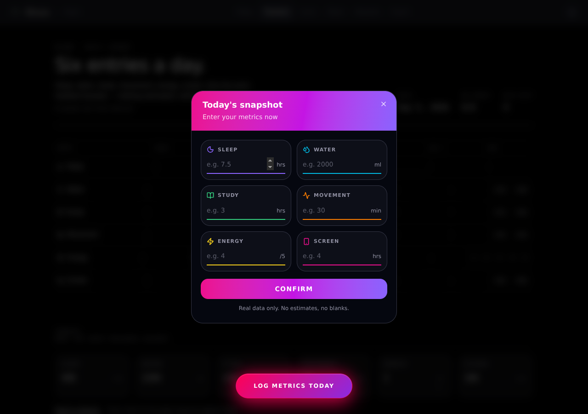
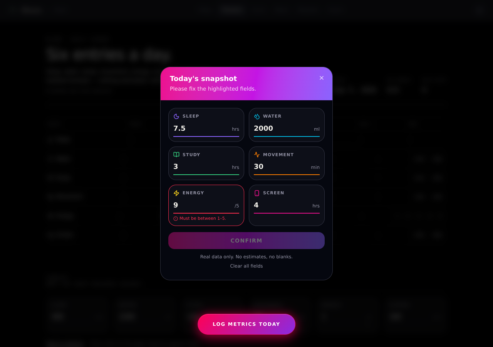
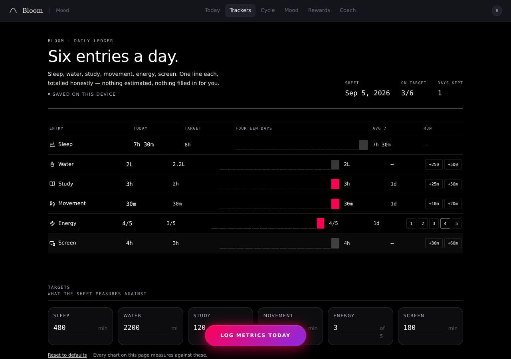
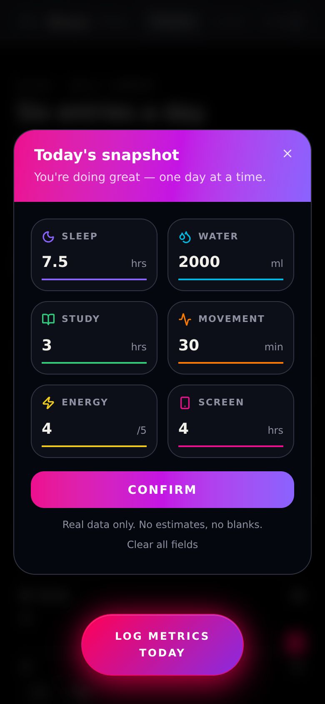

# Metrics data-entry modal — why it looked faded / unfinished, and the fix

**Date:** 2026-09-05
**Page:** `/trackers` → "REFLECT & LOG TODAY" / "LOG METRICS TODAY" button
**Reference ("perfect") version:** https://github.com/Maelix-glitch/lovable-data-entry → `src/components/metrics-entry-modal.tsx`

> **Status: FIXED** on branch `arena/01a0702b-bloom-app`. Part 1 below is the
> diagnosis (kept for the record). Part 2 is exactly what was removed,
> replaced and changed. All screenshots were taken by running the app in a
> headless browser — `current-*` = before, `fixed-*` = after,
> `reference-*` = the lovable-data-entry original.

---

## Part 2 — What was done

### After

| Empty (opens on today's real values when there are any) | Validation (Bloom's 1–5 energy scale) |
|---|---|
|  |  |

| Saved | Page after "View My Day" — 7.5 hrs → `7h 30m`, 3/6 on target |
|---|---|
|  |  |

Mobile 390 px: 

### ❌ REMOVED (7 things — all dead or broken, nothing imported them)

| Path | Why |
|---|---|
| `src/components/tk/MetricsModal.tsx` | the faded AI rewrite that was actually rendering |
| `src/components/tk/designs/MetricsEntryModal.tsx` | 3rd unused copy, 10 TypeScript errors |
| `src/styles/lovable-styles.css` | never imported; its tokens moved into `src/styles.css` |
| `src/components/lovable/ui/*` (47 files) | duplicate of `src/components/ui/*`, never imported |
| `src/hooks/lovable-use-mobile.tsx` | duplicate of `hooks/use-mobile.tsx`, never imported |
| `src/lib/lovable-utils.ts` | duplicate of `lib/utils.ts`, never imported |
| `src/lib/lovable-error-capture.ts` | duplicate of `lib/error-capture.ts`, never imported |

Kept: `src/lib/lovable-error-reporting.ts` — `routes/__root.tsx` really uses it.

### 🔁 REPLACED

`src/components/lovable/metrics-entry-modal.tsx` (your perfect file, unused)
→ **moved to** `src/components/tk/MetricsEntryModal.tsx` and wired in.

The JSX, Tailwind classes, colours, header gradient, 2-column grid, three
views (form → saved / reset), "Clear all fields", "Add Another Entry" are
**unchanged from the reference**. Only the data layer under it is Bloom's:

| Concern | Reference | Now |
|---|---|---|
| Props | `open, onClose, onSaved?` | `store, open, onClose, onSaved?` |
| Opens with | blank fields | today's values from `readTrackerValue(store, id)` |
| Save | `onSaved(values)` only | `setTrackerValues(store, [...six])` — one write, one copy of the day — then `onSaved` |
| Units typed | hrs / ml / hrs / min / **/10** / hrs | hrs / ml / hrs / min / **/5** / hrs |
| Units stored | — | sleep·study·screen ×60 → minutes; water ml; movement min; energy 1–5 |
| Validation ranges | hard-coded (0–24 h, 1–10) | derived from `trackerDef(id).min/max` → 0–18 h sleep, 0–8000 ml, 0–16 h study, 0–8 h movement, 1–5 energy, 0–20 h screen. The form can no longer accept a value the store would reject |
| Mounting | inline `fixed inset-0 z-50` | `createPortal(…, document.body)` + `z-[2000]` (same layer as every other Bloom sheet) |
| Save failure | n/a | store error string shown in red under Confirm (`role="alert"`) |
| Extras | — | `type="button"` on all buttons, `aria-label`/`aria-invalid` on inputs, Enter key confirms, `min`/`max`/`step` on inputs |

### ✏️ CHANGED

**`src/components/tk/designs/Atlas.tsx`, `Ledger.tsx`, `Strip.tsx`** — one
import + one JSX tag each:

```diff
- import { MetricsModal } from "@/components/tk/MetricsModal";
+ import { MetricsEntryModal } from "@/components/tk/MetricsEntryModal";
…
- <MetricsModal store={store} open={metricsOpen} onClose={() => setMetricsOpen(false)} />
+ <MetricsEntryModal store={store} open={metricsOpen} onClose={() => setMetricsOpen(false)} />
```

**`src/styles.css`** — the reference's tokens added to `:root` (the modal is
portalled to `<body>`, so they must be global) and registered in
`@theme inline` so `bg-metric-sleep`, `text-brand`, `border-danger`… work:

```
--metric-sleep / -water / -study / -movement / -energy / -screen
--brand  --success  --danger
--metric-surface  --metric-surface-raised   ← renamed from the reference's
                                               --surface / --surface-raised
                                               because Bloom already owns --surface
```

The component uses `var(--metric-surface)` / `var(--metric-surface-raised)`
accordingly — the only two token names that differ from the reference file.

### ✅ Verified

- `tsc`: 0 errors in touched files (project total went 21 → 11; the 11 left are
  pre-existing in `ReflectSheet.tsx`, `BloomCycleAI.tsx`, `cycle-classic.tsx`
  and a test — untouched).
- `eslint src/components/tk/MetricsEntryModal.tsx`: 0 errors.
- `vitest run`: 19/19 pass. `vite build`: succeeds.
- Headless-browser round trip on all three designs (Atlas, Ledger, Strip):
  opens → type `7.5 / 2000 / 3 / 30 / 4 / 4` → energy `9` shows
  "Must be between 1–5." → fix → Saved! → localStorage holds
  `sleepMinutes: 450, waterMl: 2000, sessions:[{minutes:180}], movementMinutes: 30, energy: 4, screenMinutes: 240`
  → page reads `7h 30m`, `3/6 on target` → reopen shows `7.5, 2000, 3, 30, 4, 4` pre-filled.
- Inputs now 146 px inside 197 px cards (was 402 px inside 201 px), no
  horizontal scroll, dialog `scrollWidth === clientWidth`.

### ⚠️ One product decision to make

The reference enforces **all six fields required** ("Real data only. No
estimates, no blanks."). Bloom's old modal allowed partial entry. I kept the
reference behaviour because that's the design you called perfect — if you'd
rather allow saving 3 of 6, it's a one-line change in `handleConfirm`
(drop the `if (!allFilled) return;` and only write the filled entries).

---

## Part 1 — Original diagnosis (2026-09-05, before the fix)

---

## TL;DR

**The app is not rendering the perfect modal at all.**

The AI that "completed" the modal did copy your perfect file into the repo
(`src/components/lovable/metrics-entry-modal.tsx` is byte-for-byte identical to
the one in `lovable-data-entry`) — **but nothing imports it**. Instead, it wrote
a *second*, hand-rolled rewrite (`src/components/tk/MetricsModal.tsx`) and wired
**that** into all three tracker designs. The rewrite is the faded, broken thing
you see. It also left a *third* half-finished copy that isn't used either.

| File | Used? | State |
|---|---|---|
| `src/components/lovable/metrics-entry-modal.tsx` | ❌ never imported | ✅ identical to your perfect repo |
| `src/components/tk/MetricsModal.tsx` | ✅ used by Atlas / Ledger / Strip | ❌ **this is the faded one** |
| `src/components/tk/designs/MetricsEntryModal.tsx` | ❌ never imported | ❌ doesn't even type-check (10 TS errors) |
| `src/styles/lovable-styles.css` | ❌ never imported | the design tokens the perfect modal needs |

Where it's wired in:

```
src/components/tk/designs/Atlas.tsx:19    import { MetricsModal } from "@/components/tk/MetricsModal";
src/components/tk/designs/Ledger.tsx:20   import { MetricsModal } from "@/components/tk/MetricsModal";
src/components/tk/designs/Strip.tsx:19    import { MetricsModal } from "@/components/tk/MetricsModal";
```

---

## Side-by-side

| What you have now (`tk/MetricsModal.tsx`) | What you want (`lovable-data-entry`) |
|---|---|
|  |  |
|  |  |

Mobile (390 px wide) — the current modal is completely unusable:


---

## The concrete bugs in `src/components/tk/MetricsModal.tsx` (the one being rendered)

Measured in the browser with DevTools-style inspection, not guessed.

### 1. Everything is grey because the "faded" colours are hard-coded

The rewrite never uses the metric colours for anything except the tiny icon.
Compare:

| Element | Current (faded) | Reference |
|---|---|---|
| Header | flat dark navy `#1A1A2E → #16213E` | pink→violet gradient (`--metric-screen → --brand → --metric-sleep`) |
| Input underline | `rgba(255,255,255,0.1)` grey | the metric's own colour (`var(--metric-sleep)` etc.) |
| Placeholder | a single `—` dash in `rgba(255,255,255,0.4)` | `e.g. 7.5` in muted foreground |
| Empty input text | `rgba(255,255,255,0.4)` (line 454) | full foreground |
| Label | `rgba(255,255,255,0.7)` | `text-muted-foreground` |
| Card bg | `rgba(255,255,255,0.02)` (almost invisible) | `var(--surface-raised)` |
| Save button when empty | `opacity: 0.4` **and** `pointer-events: none` (lines 484–485) | full-strength gradient, always visible |

So on first open every visible thing is 2%–40% white on black. That is the
"faded" look — it's literally 60 %-transparent text over a near-black box.

### 2. The inputs are twice as wide as their cards → content overflows and the modal scrolls sideways

`METRIC_INPUT` uses `flex: 1` but **no `width: 0` / `min-width: 0`**. A
`<input type="number">` has a large intrinsic width, so flex can't shrink it.
Measured:

```
input width   = 402 px
card width    = 201 px      ← input is exactly 2× the card
overflow      = 222 px per card (into the neighbouring card)
dialog scrollWidth = 888 px, clientWidth = 698 px
```

Consequences you can see in the screenshots:
- The right-hand cards get their input invisibly covered by the left card's
  input (hence the number spinner arrows appearing in odd places).
- The moment you focus the 6th input, the browser scrolls the dialog
  `190 px` to the left — the header title slides off-screen
  (`current-filled-scrolled.png`).
- On mobile it's a horizontal-scrolling mess (`current-mobile-390px.png`).

The reference avoids this with `className="w-full"` on the input (Tailwind
`width: 100%`), inside a `flex` row.

### 3. The header is fake-full-bleed using negative margins that don't match the padding

`HEADER_STYLE` uses `margin: -32px -32px 0` to pull itself edge-to-edge, but the
modal was given `padding: 0` (line 373) and the body was given its own
`padding: "0 32px 32px"`. Net result the header sits at `left: -31px,
top: -31px` and is `762 px` wide inside a `700 px` dialog — it bleeds past the
rounded corners on the left and top. The reference just puts the header as the
first child of an `overflow-hidden rounded-2xl` box, no negative margins.

### 4. The grid is `auto-fit` → 3 columns on desktop instead of the designed 2

`gridTemplateColumns: "repeat(auto-fit, minmax(180px, 1fr))"` gives 3 columns at
700 px and 1 column on phones. The reference is a fixed `grid-cols-2`, which is
what makes the 6 metrics read as three neat rows.

### 5. The CSS variables it references don't exist where it's rendered

The modal is portalled to `<body>` (via `Overlay`), so it is **outside**
`.ci-root / .tk2-root`. Anything it asks for from that scope is empty:

```
--ci-font-mono   on page: "IBM Plex Mono"…   in dialog: (empty)  → falls back to system font
--text-muted     on page: #b0b0b8            in dialog: (empty)  → close button colour undefined
--text-primary   on page: #fff               in dialog: (empty)
```

The reference has the same portalling problem solved differently: all of its
tokens (`--metric-*`, `--surface`, `--surface-raised`, `--brand`, `--success`,
`--danger`) are defined in `:root` in `styles.css`, so they're available
everywhere. **Those tokens are not defined anywhere in bloom-app's active CSS**
— they only live in `src/styles/lovable-styles.css`, which nobody imports.
(`--surface` does exist in bloom, but with a *different* meaning/value.)

### 6. Missing states / behaviour vs the reference

The reference has three views (`form` → `saved` → `reset`) plus: per-field
inline error with icon, "Clear all fields" link, reset confirmation, a proper
"Saved!" summary with all six values, "View My Day" / "Add Another Entry".
The rewrite has: a success screen that auto-closes after 1.8 s, no reset, no
clear, and `handleSave` returns a cleanup function that is thrown away
(`return () => window.clearTimeout(closeTimer)` on line 280 — that's a `useEffect`
pattern pasted into a click handler, it does nothing).

### 7. It doesn't type-check either

```
src/components/tk/MetricsModal.tsx(265,22): error TS7030: Not all code paths return a value.
src/components/tk/MetricsModal.tsx(457,52): error TS2339: Property 'unit' does not exist on type 'TrackerDef'.
```

`def.unit` is `undefined` at runtime, which is why **no unit label ("hrs",
"ml", "min") shows next to any input** in the current modal. `TrackerDef` in
`src/lib/trackers/core.ts` has no `unit` field — the rewrite assumed one.

Also line 462 hard-codes a `goals[...]` lookup chain ending in
`: "screenMinutes"` for `energy` — so the "Target" line under Energy would show
the screen-time goal.

---

## Why the AI probably ended up here

Your perfect modal uses Bloom-incompatible units/ranges (sleep in **hours**
0–24, energy **1–10**) while Bloom's store wants **minutes** and energy **1–5**
(`core.ts`: `sleep max 18*60`, `energy min 1 max 5`). Rather than adapt the
perfect component's data layer, the AI rewrote the *whole* component from
scratch with inline styles and lost the design in the process.

---

## The fix checklist that Part 2 carried out

(Written before the fix; every item below is now done.)

1. **Render the right component.** In `Atlas.tsx`, `Ledger.tsx`, `Strip.tsx`
   swap the import from `@/components/tk/MetricsModal` to your perfect
   component (or a thin Bloom adapter around it). Delete
   `tk/MetricsModal.tsx` and `tk/designs/MetricsEntryModal.tsx` so nobody
   picks them up again.

2. **Make the reference's tokens available globally.** Its whole look depends
   on `--metric-sleep/-water/-study/-movement/-energy/-screen`, `--brand`,
   `--surface-raised`, `--success`, `--danger`. Copy the `@layer base { :root
   { … } }` block from `lovable-data-entry/src/styles.css` (lines ~112–124)
   into `src/styles.css` (rename `--surface` → e.g. `--modal-surface` because
   bloom already defines `--surface` for cards) and register them in
   `@theme inline` if you want the `text-metric-sleep` utilities. Delete the
   unused `src/styles/lovable-styles.css`.

3. **Keep the reference component's DOM/classes exactly as-is** — it already
   handles: `w-full` inputs (no overflow), `grid-cols-2`, gradient header,
   coloured underlines, `dark` class, `overflow-hidden rounded-2xl`, all 3
   views.

4. **Adapt only the data layer** (a ~30-line wrapper is enough):
   - `onSaved(values)` → convert hours→minutes for sleep/study/screen and
     call `setTrackerValues(store, [...])` from `tk/designs/shared.tsx`.
   - Pre-fill from `readTrackerValue(store, id)` (minutes→hours).
   - Either change `METRICS[…].validate` to Bloom's ranges (energy 1–5,
     sleep ≤ 18 h, water ≤ 8000 ml, …) or map 1–10 → 1–5 on save.
   - The reference's "all six required" rule (`allFilled`) may be too strict
     for Bloom's "partial entry OK" model — decide which you want.

5. **Portal it.** Your reference renders inline (`fixed inset-0 z-50`). Inside
   Bloom the tracker pages are fine (no `transform`/`filter` ancestors found),
   but for safety wrap it in the existing `<Overlay>` from `shared.tsx` or use
   `createPortal(…, document.body)` and bump `z-50` → `z-[2000]` to match the
   other Bloom sheets.

6. **Duplicate shadcn folder.** `src/components/lovable/ui/*` is a copy of
   `src/components/ui/*` (only 2 files differ). Nothing imports the `lovable`
   copy — safe to delete along with the `hooks/lovable-use-mobile.tsx`,
   `lib/lovable-utils.ts` and `lib/lovable-error-capture.ts` duplicates.
   (**Keep** `lib/lovable-error-reporting.ts` — `routes/__root.tsx` uses it.)

---

## How the screenshots were made

Both projects were run with `vite dev` and driven with headless Chromium at
1280×900 (and 390×844 for mobile). `current-*` = bloom-app `/trackers` with the
Ledger design (Atlas and Strip render the identical modal). `reference-*` =
`lovable-data-entry` `/`.
